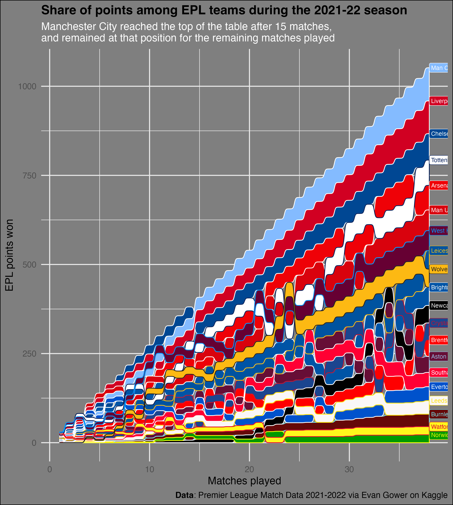

# Premier League Match Data 2021-2022

Messed around with creating a summary table, but in the end decided to try a bump sankey. Originally, I just focused on the winning team, but in the end thought it would be nice to fill the streams using primary team colours. I looked these up manually from the website <https://teamcolours.netlify.app>, and saved to the file \`teams.csv\` included here. I realise eveything clashes.

